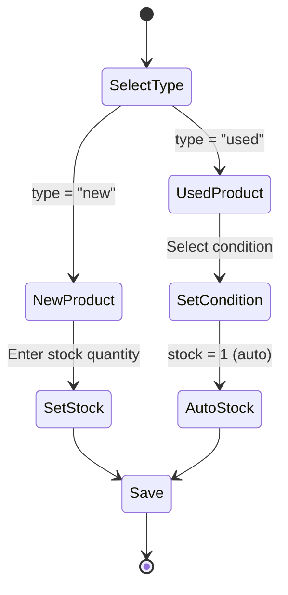

# Design Document: Product Condition Types

## Overview

This design document outlines the implementation of a product type and condition system for the e-commerce platform. The system will support two product types (New and Used) with different stock management behaviors, and a condition rating system for used products with interactive tooltips.

## Architecture

The feature follows the existing Next.js architecture with:
- Prisma schema updates for new fields
- API route modifications for CRUD operations
- React components for UI display and admin management
- Client-side state management for tooltips

```mermaid
graph TB
    subgraph Database
        Product[Product Model]
    end
    
    subgraph API
        ProductAPI[/api/products]
    end
    
    subgraph Components
        AdminProducts[Admin Products Page]
        ProductCard[Product Card]
        ProductDetail[Product Detail]
        Filters[Filter Component]
        ConditionTooltip[Condition Tooltip]
    end
    
    Product --> ProductAPI
    ProductAPI --> AdminProducts
    ProductAPI --> ProductCard
    ProductAPI --> ProductDetail
    ProductCard --> ConditionTooltip
    ProductDetail --> ConditionTooltip
```

## Components and Interfaces

### 1. Database Schema Updates

Add new fields to the Product model in Prisma:

```prisma
model Product {
  // ... existing fields ...
  productType     String    @default("new")     // "new" | "used"
  condition       String?                        // "mint" | "excellent" | "very-good" | "good" | "fair"
  conditionNotes  String?                        // Additional notes for used items
}
```

### 2. TypeScript Interfaces

```typescript
// Product type enum
type ProductType = 'new' | 'used';

// Condition rating enum
type ConditionRating = 'mint' | 'excellent' | 'very-good' | 'good' | 'fair';

// Condition descriptions
const CONDITION_DESCRIPTIONS: Record<ConditionRating, string> = {
  'mint': 'Mint items are in essentially new original condition but have been opened or played.',
  'excellent': 'Excellent items are almost entirely free from blemishes and other visual defects and have been played or used with the utmost care.',
  'very-good': 'Very Good items may show a few slight marks or scratches but are fully functional and in overall great shape.',
  'good': 'Good items show moderate wear but are fully functional.',
  'fair': 'Fair condition gear should function but will show noticeable cosmetic damage or other issues.'
};

// Extended Product interface
interface Product {
  // ... existing fields ...
  productType: ProductType;
  condition?: ConditionRating;
  conditionNotes?: string;
}
```

### 3. ConditionTooltip Component

A reusable component for displaying condition information:

```typescript
interface ConditionTooltipProps {
  condition: ConditionRating;
  className?: string;
}

// Component renders a badge with hover/tap tooltip
// Uses Radix UI Tooltip for accessibility
```

### 4. Filter Component Updates

Update the Filters component to:
- Replace Vietnamese text with English
- Add product type filter option
- Add condition filter for used products

### 5. Admin Product Form Updates

Extend the product form with:
- Product type selector (New/Used)
- Condition selector (visible when Used is selected)
- Condition notes textarea (optional)
- Auto-set stock to 1 when Used is selected
- Disable stock input when Used is selected

## Data Models

### Product Type Flow



### Stock Status Logic

| Product Type | Stock Editable | Default Stock | Stock Status Options |
|-------------|----------------|---------------|---------------------|
| New | Yes | 0 | in-stock, sold-out, pre-order |
| Used | No (auto = 1) | 1 | in-stock, sold-out |


## Correctness Properties

*A property is a characteristic or behavior that should hold true across all valid executions of a system—essentially, a formal statement about what the system should do. Properties serve as the bridge between human-readable specifications and machine-verifiable correctness guarantees.*

### Property 1: Stock Status Round-Trip Persistence

*For any* product and any valid stock status value ("in-stock", "sold-out", "pre-order"), saving the stock status and then retrieving the product should return the same stock status value.

**Validates: Requirements 2.1, 2.2, 2.3, 2.4, 2.5**

### Property 2: Product Type Constraint

*For any* product, the productType field must be either "new" or "used". Any other value should be rejected by the system.

**Validates: Requirements 3.1, 3.3**

### Property 3: Used Product Stock Invariant

*For any* product with productType "used", the stock quantity must always equal 1. Setting any other stock value for a used product should result in stock being 1.

**Validates: Requirements 5.3**

### Property 4: Condition Rating Constraint

*For any* used product, the condition field must be one of: "mint", "excellent", "very-good", "good", "fair". Any other value should be rejected.

**Validates: Requirements 5.2, 5.5**

### Property 5: Condition Description Mapping

*For any* valid condition rating, the CONDITION_DESCRIPTIONS mapping should return the correct description string as specified in the requirements.

**Validates: Requirements 6.2, 6.3, 6.4, 6.5, 6.6**

### Property 6: New Product Stock Flexibility

*For any* product with productType "new" and any positive integer stock value, the system should accept and persist that stock value.

**Validates: Requirements 4.2**

## Error Handling

### Validation Errors

| Error Case | Response |
|-----------|----------|
| Invalid product type | Return 400 with message "Product type must be 'new' or 'used'" |
| Missing condition for used product | Return 400 with message "Condition is required for used products" |
| Invalid condition value | Return 400 with message "Invalid condition rating" |
| Attempting to set stock > 1 for used product | Auto-correct to 1, log warning |

### Database Errors

- Connection failures: Return 500 with generic error message
- Constraint violations: Return 400 with specific field error

## Testing Strategy

### Unit Tests

1. **Filter Component Tests**
   - Verify all labels are in English
   - Test filter functionality remains intact

2. **Condition Tooltip Tests**
   - Verify correct description for each condition
   - Test tooltip visibility states

3. **Admin Form Tests**
   - Test product type selection behavior
   - Test condition selector visibility
   - Test stock input enable/disable logic

### Property-Based Tests

Using a property-based testing library (e.g., fast-check for TypeScript):

1. **Stock Status Persistence Test** (Property 1)
   - Generate random products with random stock statuses
   - Save and retrieve, verify equality
   - Minimum 100 iterations

2. **Product Type Validation Test** (Property 2)
   - Generate random strings for productType
   - Verify only "new" and "used" are accepted
   - Minimum 100 iterations

3. **Used Product Stock Test** (Property 3)
   - Generate used products with various stock values
   - Verify stock is always 1 after save
   - Minimum 100 iterations

4. **Condition Rating Validation Test** (Property 4)
   - Generate random condition strings
   - Verify only valid conditions are accepted
   - Minimum 100 iterations

5. **Condition Description Test** (Property 5)
   - For each valid condition, verify description matches spec
   - This is exhaustive (5 cases)

6. **New Product Stock Test** (Property 6)
   - Generate new products with random positive stock values
   - Verify stock is persisted correctly
   - Minimum 100 iterations

### Integration Tests

1. Full CRUD flow for new products
2. Full CRUD flow for used products
3. Product type change scenarios
4. Filter functionality with new fields
