# James Sax Corner — Architecture Diagram

```mermaid
flowchart TB
    subgraph Client["Browser / Customer"]
        Shopper["Shopper"]
        AdminUser["Admin (James)"]
    end

    subgraph NextApp["Next.js App (App Router)"]
        direction TB

        subgraph Public["Public Pages"]
            Home["/ Homepage"]
            Shop["/shop"]
            Item["/item/[slug]"]
            Brand["/b/[slug], /p/[slug]"]
            Blog["/blog"]
            Cart["/cart"]
            Checkout["/checkout"]
            Account["/account"]
            Auth["/auth (login, register, reset)"]
            OrderSecure["/order-secure/[slug] (guest tracking)"]
        end

        subgraph AdminPanel["Admin Dashboard (/admin)"]
            AdminProducts["Products / Categories / Brands"]
            AdminOrders["Orders / Invoices"]
            AdminContent["Blog / Banners / Promos / Popups"]
            AdminSettings["Site Settings / Shipping / Users"]
            AdminAnalytics["Analytics (GA4 Realtime)"]
        end

        subgraph API["API Routes (/api)"]
            ApiProducts["products, categories, brands"]
            ApiOrders["orders, cart, checkout"]
            ApiAuth["auth (NextAuth)"]
            ApiPaypal["paypal (create/capture/IPN)"]
            ApiUpload["upload (Cloudinary sig)"]
            ApiAdmin["admin/* (protected)"]
        end

        Middleware["middleware.ts\n(route protection, auth.config.ts)"]
    end

    subgraph Data["Data Layer"]
        Prisma["Prisma ORM"]
        Mongo[("MongoDB\nProducts, Orders, Users,\nInvoices, Reviews, etc.")]
    end

    subgraph External["External Services"]
        PayPal["PayPal API\n(REST + IPN)"]
        Cloudinary["Cloudinary\n(image hosting/CDN)"]
        SMTP["SMTP\n(order/auth emails)"]
        OAuth["Google / Facebook OAuth"]
        GA4["Google Analytics 4"]
    end

    Shopper --> Public
    AdminUser --> AdminPanel

    Public --> API
    AdminPanel --> API
    API --> Middleware
    Middleware --> Prisma
    Prisma --> Mongo

    ApiPaypal --> PayPal
    ApiUpload --> Cloudinary
    ApiAuth --> OAuth
    ApiOrders --> SMTP
    AdminAnalytics --> GA4

    Checkout --> ApiPaypal
    OrderSecure --> ApiOrders
```

            AdminOrders["Orders / Invoices"]
            AdminContent["Blog / Banners / Promos / Popups"]
            AdminSettings["Site Settings / Shipping / Users"]
            AdminAnalytics["Analytics (GA4 Realtime)"]
        end

        subgraph API["API Routes (/api)"]
            ApiProducts["products, categories, brands"]
            ApiOrders["orders, cart, checkout"]
            ApiAuth["auth (NextAuth)"]
            ApiPaypal["paypal (create/capture/IPN)"]
            ApiUpload["upload (Cloudinary sig)"]
            ApiAdmin["admin/* (protected)"]
        end

        Middleware["middleware.ts\n(route protection, auth.config.ts)"]
    end

    subgraph Data["Data Layer"]
        Prisma["Prisma ORM"]
        Mongo[("MongoDB\nProducts, Orders, Users,\nInvoices, Reviews, etc.")]
    end

    subgraph External["External Services"]
        PayPal["PayPal API\n(REST + IPN)"]
        Cloudinary["Cloudinary\n(image hosting/CDN)"]
        SMTP["SMTP\n(order/auth emails)"]
        OAuth["Google / Facebook OAuth"]
        GA4["Google Analytics 4"]
    end

    Shopper --> Public
    AdminUser --> AdminPanel

    Public --> API
    AdminPanel --> API
    API --> Middleware
    Middleware --> Prisma
    Prisma --> Mongo

    ApiPaypal --> PayPal
    ApiUpload --> Cloudinary
    ApiAuth --> OAuth
    ApiOrders --> SMTP
    AdminAnalytics --> GA4

    Checkout --> ApiPaypal
    OrderSecure --> ApiOrders
    
